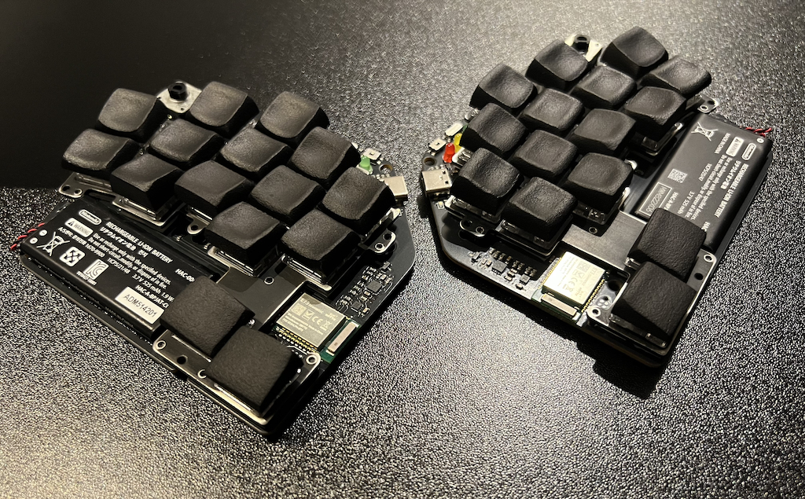

# Pipra

30-key low-profile electro-capacitive wireless split keyboard.

## Production

The PCB can be assembled via JLCPCB. See production files in the `production` directory.

### EC Parts

The only way to get switches currently is to use a Niz L84 or L99 keyboard as a donor. Search Taobao, e.g., [this](https://detail.tmall.com/item.htm?_u=d20fti35341a4a&id=878704443735&skuId=5947860879567) or [this](https://item.taobao.com/item.htm?id=865123524234&skuId=5789959885060).

### Keycaps

This keyboard uses 18x16mm spacing, which means you'll need custom keycaps. I’m currently aware of a few options:

- [Pseudoku's DC](https://discord.com/channels/714176584269168732/879817722328920174/1351967655707410532) – shared on the Absolem Club Discord server ([invite](https://discord.gg/DbCfZfZ))
- [Fingerpunch CMY](https://github.com/sadekbaroudi/fingerpunch/tree/master/keycaps/CMY)

### Plate

You'll need a 1.5mm metal plate with threaded holes. I used SendCutSend, but you're free to use any laser cutting service. Powder coating is not recommended, as it may alter the cutout dimensions and cause sliders to get stuck in the housings.

Most laser cutting services offer thread tapping, but you can also use a cheap M2 tap yourself.

## Support

[ZMK Firmware](https://github.com/ssbb/pipra-zmk-config)

Feel free to ask any questions in `#ssbb` channel on Absolem Club discord server ([invite](https://discord.gg/DbCfZfZ)).
